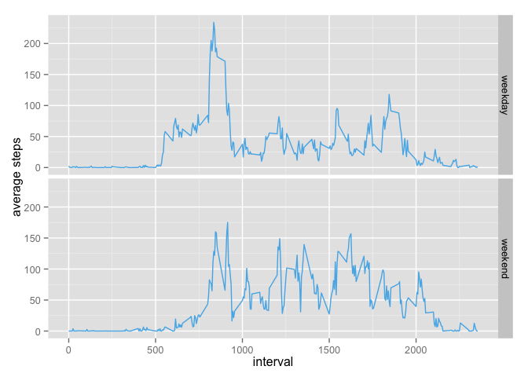

# Reproducible Research: Peer Assessment 1

Loading the data from the unzipped `activity.zip` file

## Loading and preprocessing the data

We load the data from the unzipped file (conditionally we unzip it). We cast the date column to be actual Date objects.


```r
library(dplyr)
```

```
## 
## Attaching package: 'dplyr'
## 
## The following objects are masked from 'package:stats':
## 
##     filter, lag
## 
## The following objects are masked from 'package:base':
## 
##     intersect, setdiff, setequal, union
```

```r
if (!file.exists("activity.csv")) {
  unzip("activity.zip")
}

df <- read.csv("./activity.csv")
df$date <- as.Date(df$date, format="%Y-%m-%d")
```


## What is mean total number of steps taken per day?

The sum of the total number of steps taken per date (missing observations removed from summation)


```r
total_steps_per_day <- df %>% group_by(date) %>% 
  summarize(total_steps = sum(steps, na.rm=TRUE))
```


```r
hist(total_steps_per_day$total_steps, xlab='Total steps / day', main='Total steps per day histogram')
```

 

Calculating the mean and median


```r
mean(total_steps_per_day$total_steps)
```

```
## [1] 9354.23
```


```r
median(total_steps_per_day$total_steps)
```

```
## [1] 10395
```

## What is the average daily activity pattern?


```r
average_steps_per_interval <- df %>% group_by(interval) %>% 
  summarize(mean_steps = mean(steps, na.rm=TRUE))
```


```r
plot(average_steps_per_interval$interval, average_steps_per_interval$mean_steps, type = "l",
     xlab = "interval", ylab = "mean steps taken")
```

 

find the interval where max average steps occur across all intervals


```r
inter <- head(order(average_steps_per_interval$mean_steps, decreasing = TRUE), 1)
inter
```

```
## [1] 104
```


```r
average_steps_per_interval[inter]
```

```
## Source: local data frame [288 x 1]
## 
## Variables not shown: NA (NULL)
```

## Imputing missing values

Total number of missing values in the dataset


```r
nrow(df[is.na(df$steps),])
```

```
## [1] 2304
```

We will fill in the na values by using the mean of that interval across all days.
A new dataset (called df2) is created, equal to the original dataset, 
with the missing data filled in.


```r
df2 <- df %>% left_join(average_steps_per_interval, by='interval') %>% 
  select(steps, date, interval, mean_steps)
df2[is.na(df2$steps),"steps"] <- df2[is.na(df2$steps),]$mean_steps
df2 <- df2[,c("steps", "date", "interval")]
```


```r
total_steps_per_day2 <- df2 %>% group_by(date) %>% 
  summarize(total_steps = sum(steps, na.rm=TRUE))
```


```r
hist(total_steps_per_day2$total_steps, xlab='Total steps / day', main='Total steps per day with missing values filled in')
```

 

Calculating the mean and median for the sets with the missing values filled in


```r
mean(total_steps_per_day2$total_steps)
```

```
## [1] 10766.19
```


```r
median(total_steps_per_day2$total_steps)
```

```
## [1] 10766.19
```

Values are different from the original dataframe. Mean is now greater thatn the previous mean and the same as median.

## Are there differences in activity patterns between weekdays and weekends?

Create a new factor variable in the dataset with two levels – “weekday” and “weekend” indicating whether a given date is a weekday or weekend day.


```r
df[, "day_type"] <- "weekday"
df[is.element(weekdays(df$date), c("Saturday", "Sunday")),"day_type"] <- "weekend"
```


```r
library("ggplot2")
average_steps <- df %>% group_by(day_type, interval) %>%
           summarize(avg_steps = mean(steps, na.rm = TRUE))

avg_steps_weekday <- average_steps[average_steps$day_type == "weekday",]

avg_steps_weekend <- average_steps[average_steps$day_type == "weekend",]

p <- ggplot(average_steps, aes(interval,avg_steps)) + geom_line(color="#56B4E9") + labs(x="interval", y="average steps")
p + facet_grid(day_type ~ .)
```

 
